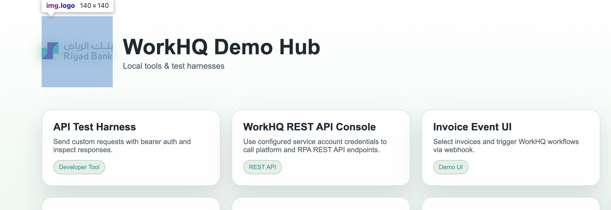

# WorkHQ Demo Assets

A local demonstration hub for WorkHQ API calls, trigger scenarios, webhook testing, mock events, and optional S3 file drops.

The project contains a static browser interface and a small Express backend. The backend handles WorkHQ authentication and protected API calls so client secrets do not need to be placed in browser code.



## Features

- WorkHQ REST API console with reusable endpoint presets
- Invoice, email, KYC, Salesforce, Slack, and file-drop demonstrations
- WorkHQ service-account authentication through a local Express proxy
- WorkHQ environment syncing and selection
- Webhook request testing
- Optional AWS S3 file uploads
- Switchable customer themes

## Requirements

- [Node.js](https://nodejs.org/) 18 or newer
- npm, included with Node.js
- WorkHQ tenant and service-account details for API-backed demonstrations

Python, Bash, and global npm packages are not required.

## Install

Clone the repository and install its dependencies.

### macOS

```sh
git clone <repository-url>
cd <repository-folder>
npm install
```

### Windows PowerShell

```powershell
git clone <repository-url>
cd <repository-folder>
npm install
```

## Configure WorkHQ

Create a local configuration file from the supplied example.

### macOS

```sh
cp config/workhq-config.example.json config/workhq-config.json
```

### Windows PowerShell

```powershell
Copy-Item config/workhq-config.example.json config/workhq-config.json
```

Edit `config/workhq-config.json`:

```json
{
  "workhq": {
    "tenantDomain": "example.nextgen.blueprism.com",
    "tenantId": "your-tenant-id",
    "clientId": "your-service-account-client-id",
    "clientSecret": "your-service-account-client-secret",
    "region": "eu-central",
    "environmentId": "",
    "defaultPageSize": 25
  }
}
```

The local configuration file is excluded from Git. Do not commit client secrets, bearer tokens, or production credentials.

WorkHQ settings can also be supplied using environment variables:

| Variable | Purpose |
| --- | --- |
| `WORKHQ_TENANT_DOMAIN` | WorkHQ tenant domain |
| `WORKHQ_TENANT_ID` | WorkHQ tenant ID |
| `WORKHQ_CLIENT_ID` | Service-account client ID |
| `WORKHQ_CLIENT_SECRET` | Service-account client secret |
| `WORKHQ_REGION` | Operating region, such as `eu-central` |
| `WORKHQ_ENVIRONMENT_ID` | Default environment ID |
| `WORKHQ_PAGE_SIZE` | Default API page size |

## Run

Start the static demo hub and Express proxy together:

```sh
npm run dev
```

This command works on macOS, Windows PowerShell, Command Prompt, and Linux.

Open:

- Demo hub: [http://localhost:8080](http://localhost:8080)
- Express proxy: [http://localhost:3000](http://localhost:3000)
- Token test: [http://localhost:3000/token](http://localhost:3000/token)

Stop both services with `Ctrl+C`.

## Run Services Separately

Start only the Express proxy:

```sh
npm run proxy
```

Start only the static demo hub:

```sh
npm run web
```

## Optional S3 File Drop

The file-drop demonstration can upload objects to AWS S3 through the Express backend.

### macOS

```sh
export AWS_REGION=eu-central-1
export S3_BUCKET_NAME=your-demo-bucket
export AWS_ACCESS_KEY_ID=your-access-key
export AWS_SECRET_ACCESS_KEY=your-secret-key
export S3_PREFIX=workhq-demo/
npm run dev
```

### Windows PowerShell

```powershell
$env:AWS_REGION="eu-central-1"
$env:S3_BUCKET_NAME="your-demo-bucket"
$env:AWS_ACCESS_KEY_ID="your-access-key"
$env:AWS_SECRET_ACCESS_KEY="your-secret-key"
$env:S3_PREFIX="workhq-demo/"
npm run dev
```

Prefer short-lived AWS credentials or a suitably restricted development identity.

## Useful Commands

| Command | Description |
| --- | --- |
| `npm install` | Install project dependencies |
| `npm run dev` | Start the demo hub and proxy |
| `npm run proxy` | Start only the Express proxy |
| `npm run web` | Start only the static demo hub |
| `npm test` | Validate the server JavaScript syntax |

## Project Layout

```text
config/          WorkHQ configuration example and ignored local config
data/            Ignored local runtime state and mock events
docs/            Implementation and setup notes
public/          Static demo hub, pages, assets, scripts, and styles
samples/         Example payloads and sample data
server/          Express proxy, static server, and development launcher
```

## Themes

Use the theme selector in the bottom-right corner of the demo pages to switch themes. The selection is stored in browser local storage.

Shared theme files:

- `public/styles/theme.css`
- `public/styles/base.css`
- `public/scripts/theme-switcher.js`

## Troubleshooting

### `/token` returns 404

Use `http://localhost:3000/token`. Port `8080` only serves the static demo pages, so `http://localhost:8080/token` returns 404.

### Cannot connect to port 3000 or 8080

Run `npm run dev` and keep that terminal open. Check that another application is not already using either port.

### Token request fails

Confirm that `config/workhq-config.json` exists and contains the correct tenant domain, tenant ID, client ID, and client secret.

### S3 file drop fails

Confirm that the AWS environment variables are set in the same terminal that runs `npm run dev`, and that the AWS identity can write to the configured bucket.

## Security

- Keep `config/workhq-config.json`, `.env`, tokens, and runtime data out of Git.
- Use this project as a local demonstration tool, not as a production authentication service.
- Restrict service-account and AWS permissions to the minimum required for the demonstrations.
